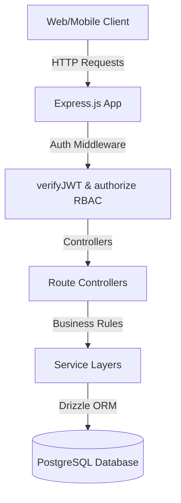
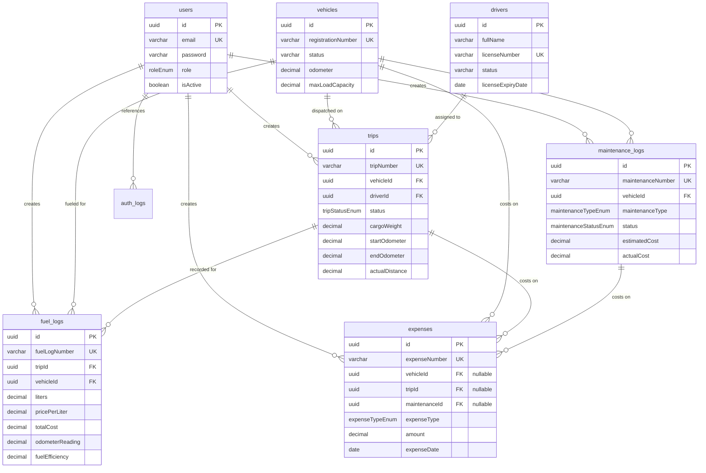
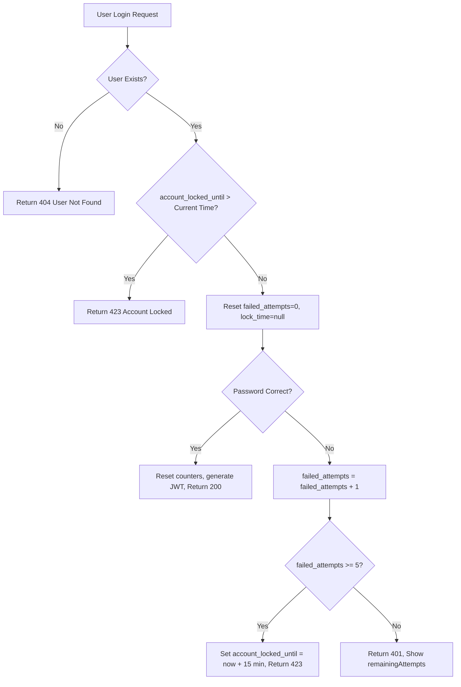
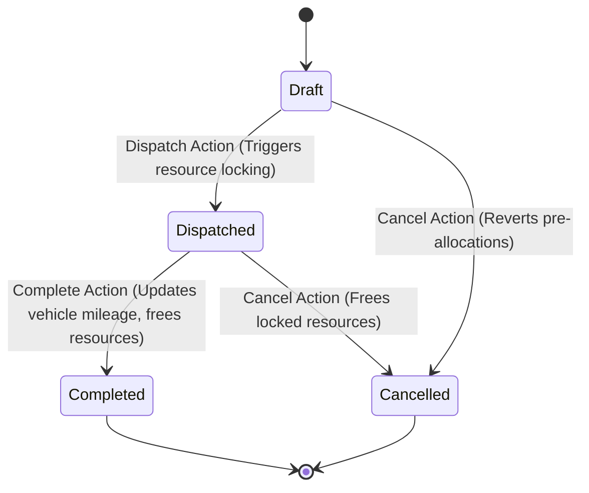

# TransitOps Fleet Management System - Technical Documentation

Welcome to the comprehensive technical documentation for the **TransitOps Backend System**, designed for fleet coordination, driver tracking, trip dispatches, vehicle maintenance logs, fuel reporting, operational expenses, and security protection.

---

## 1. System Architecture

TransitOps is built on a highly modular backend architecture using modern Node.js conventions:
* **Runtime Environment**: Node.js (ES Modules syntax).
* **Application Framework**: Express.js with a centralized `ErrorHandler` middleware and custom `ApiError`/`ApiResponse` handlers.
* **Database Layer**: PostgreSQL managed via **Drizzle ORM** for type-safe queries and schema migrations.
* **Security & Authentication**: JWT (JSON Web Tokens) stored in secure HTTP-only cookies, combined with bcrypt password hashing and brute-force brute protection (Account Lockout).
* **Role-Based Access Control (RBAC)**: Custom authorization middleware restricting access dynamically across four roles: `Fleet Manager`, `Dispatcher`, `Safety Officer`, and `Financial Analyst`.



---

## 2. Database Schema Diagrams & Models

Below is the complete entity relation map for the database.



---

## 3. Detailed Module Workflows & Integrations

### A. Account Lockout Workflow
Protects logins from brute-force dictionary attacks.
* **Mechanism**: Max 5 attempts. Lock duration: 15 minutes.
* **Unlock Trigger**: Checks lock date on the *next* login request. If expired, unlocks, resets attempts to 0, and validates password. No background workers or cron processes are required.



### B. Trip Lifecycle & Status Triggers
Trips manage the active deployment of fleet resources, triggering status locks.



* **Dispatch Triggers (Transaction)**:
  * Checks vehicle exists and status is `"Available"`.
  * Checks driver exists, status is `"Available"`, and license is not expired.
  * Checks trip cargo weight <= vehicle payload capacity.
  * Locks vehicle status to `"On Trip"`.
  * Locks driver status to `"On Trip"`.
  * Records `start_odometer` matching the vehicle's current mileage.
  * Sets status to `"Dispatched"`.
* **Completion Triggers (Transaction)**:
  * Validates that `end_odometer >= start_odometer`.
  * Updates vehicle mileage: `vehicle.odometer = end_odometer`.
  * Frees vehicle: `vehicle.status = "Available"`.
  * Frees driver: `driver.status = "Available"`.
  * Sets status to `"Completed"`.
* **Cancellation Triggers (Transaction)**:
  * Reverts vehicle status to `"Available"` (if not `"Retired"`).
  * Reverts driver status to `"Available"`.
  * Sets status to `"Cancelled"`.

### C. Maintenance Lifecycle & Vehicle Status Triggers
Integrates directly with vehicles, taking them off duty during repairs.
* **Creation Triggers**:
  * Prevents duplicate active logs (only 1 `"Open"` or `"In Progress"` log per vehicle).
  * Automatically sets vehicle status to `"In Shop"`.
* **Start Triggers**:
  * Sets status to `"In Progress"` and ensures vehicle is `"In Shop"`.
* **Completion/Cancellation Triggers**:
  * Returns vehicle status to `"Available"`, **unless** the vehicle has been marked as `"Retired"` (in which case it remains `"Retired"`).

### D. Fuel Log Calculations
* **Total Cost**: Auto-calculated on write/update: `liters * price_per_liter`.
* **Fuel Efficiency**: Auto-calculated on write/update: `trip.actual_distance / liters`.
* **Odometer Bound Check**: Validates `odometer_reading >= vehicle.current_odometer` before logging.
* **Constraints**: Can only log fuel for completed trips. Maximum 1 fuel log per trip.

### E. Expense Management & Financial Integrations
Primary source for dashboard cost aggregates.
* **Entity Mapping Rules**: Must be linked to at least one entity (`vehicle_id`, `trip_id`, or `maintenance_id`).
* **Fuel Expense Duplication Check**: Fuel type expenses require a `trip_id` and check if a Fuel Log exists or if another Fuel type expense already exists for the trip to prevent double accounting.

---

## 4. API Endpoints Catalog

### A. Authentication Module
| HTTP Method | Endpoint | Allowed Roles | Description |
|:---|:---|:---|:---|
| **POST** | `/api/auth/register` | Open | Register a new account |
| **POST** | `/api/auth/login` | Open | Login, checks lock status, returns JWT cookie |
| **POST** | `/api/auth/logout` | Open | Clears authentication token cookie |
| **GET** | `/api/auth/me` | Authenticated | Fetch active user credentials |

#### Payload Examples
* **Login (POST `/api/auth/login`)**:
```json
{
  "email": "manager@transitops.com",
  "password": "SecurePassword123"
}
```
* **Attempts Exceeded Response (423 Locked)**:
```json
{
  "success": false,
  "message": "Account locked due to multiple failed login attempts.",
  "lockedFor": "15 minutes",
  "lockedUntil": "2026-07-12T12:20:00.000Z"
}
```

---

### B. Vehicle Module
| HTTP Method | Endpoint | Allowed Roles | Description |
|:---|:---|:---|:---|
| **GET** | `/api/vehicles/available` | All | Fetch all active vehicles ready for trip dispatches |
| **GET** | `/api/vehicles` | All | Paginated list with searches & filters |
| **GET** | `/api/vehicles/:id` | All | Get single vehicle details |
| **POST** | `/api/vehicles` | Fleet Manager | Create new vehicle |
| **PATCH** | `/api/vehicles/:id` | Fleet Manager | Update vehicle details |
| **DELETE** | `/api/vehicles/:id` | Fleet Manager | Soft delete vehicle |

---

### C. Driver Module
| HTTP Method | Endpoint | Allowed Roles | Description |
|:---|:---|:---|:---|
| **GET** | `/api/drivers` | All | Paginated list with filters and search |
| **GET** | `/api/drivers/:id` | All | Get single driver details |
| **POST** | `/api/drivers` | Fleet Manager | Create driver profile |
| **PATCH** | `/api/drivers/:id` | Fleet Manager | Update driver profile |
| **DELETE** | `/api/drivers/:id` | Fleet Manager | Soft delete driver |

---

### D. Trip Module
| HTTP Method | Endpoint | Allowed Roles | Description |
|:---|:---|:---|:---|
| **GET** | `/api/trips/statistics` | All | Get trip statistics (active, completed, draft) |
| **GET** | `/api/trips` | All | Paginated, searchable list with inner joins |
| **GET** | `/api/trips/:id` | All | Get single trip with vehicle and driver details |
| **POST** | `/api/trips` | Fleet Manager, Dispatcher | Create a new trip in `"Draft"` state |
| **PATCH** | `/api/trips/:id` | Fleet Manager, Dispatcher | Update draft trip |
| **DELETE** | `/api/trips/:id` | Fleet Manager, Dispatcher | Soft delete draft trip |
| **POST** | `/api/trips/:id/dispatch`| Fleet Manager, Dispatcher | Dispatch trip (locks resource status to `"On Trip"`) |
| **POST** | `/api/trips/:id/complete`| Fleet Manager, Dispatcher | Complete trip (records mileage, frees resources) |
| **POST** | `/api/trips/:id/cancel`  | Fleet Manager, Dispatcher | Cancel trip (frees resources) |

#### Payload Examples
* **Create Trip (POST `/api/trips`)**:
```json
{
  "vehicle_id": "d6939660-b5f8-4779-a12b-74a3bb495500",
  "driver_id": "a988d8b1-3642-4919-86bd-3b6bc8a90100",
  "source": "Ahmedabad Logistics Hub",
  "destination": "Surat Delivery Point",
  "cargo_weight": 420.50,
  "planned_distance": 265.00,
  "revenue": 18500.00,
  "remarks": "Express delivery"
}
```
* **Complete Trip (POST `/api/trips/:id/complete`)**:
```json
{
  "end_odometer": 25265,
  "actual_distance": 265,
  "fuel_consumed": 18.5
}
```

---

### E. Maintenance Module
| HTTP Method | Endpoint | Allowed Roles | Description |
|:---|:---|:---|:---|
| **GET** | `/api/maintenance/statistics` | All | Get cost and status counts |
| **GET** | `/api/maintenance` | All | Searchable and filtered paginated list |
| **GET** | `/api/maintenance/:id` | All | Get maintenance logs with vehicle details |
| **POST** | `/api/maintenance` | Fleet Manager | Create new maintenance log (sets vehicle to `"In Shop"`) |
| **PATCH** | `/api/maintenance/:id` | Fleet Manager | Update log (cannot edit vehicles or numbers) |
| **DELETE** | `/api/maintenance/:id` | Fleet Manager | Soft delete logs (completed records cannot be deleted) |
| **POST** | `/api/maintenance/:id/start` | Fleet Manager | Start maintenance (sets status to `"In Progress"`) |
| **POST** | `/api/maintenance/:id/complete`| Fleet Manager | Complete maintenance (reverts vehicle status) |
| **POST** | `/api/maintenance/:id/cancel` | Fleet Manager | Cancel maintenance (reverts vehicle status) |

#### Payload Examples
* **Complete Maintenance (POST `/api/maintenance/:id/complete`)**:
```json
{
  "actual_cost": 4250.00,
  "completion_date": "2026-07-12",
  "remarks": "Brake system components replaced"
}
```

---

### F. Fuel Log Module
| HTTP Method | Endpoint | Allowed Roles | Description |
|:---|:---|:---|:---|
| **GET** | `/api/fuel/statistics` | All | Get cost sums and efficiency averages |
| **GET** | `/api/fuel/monthly` | All | Get monthly summaries (`?month=7&year=2026`) |
| **GET** | `/api/fuel/vehicle/:vehicleId` | All | Fetch vehicle specific fuel log history |
| **GET** | `/api/fuel/trip/:tripId` | All | Fetch fuel logs linked to specific trip |
| **GET** | `/api/fuel` | All | Searchable and paginated fuel logs list |
| **GET** | `/api/fuel/:id` | All | Get single fuel log details |
| **POST** | `/api/fuel` | Fleet Manager, Dispatcher | Create fuel log (calculates cost and efficiency) |
| **PATCH** | `/api/fuel/:id` | Fleet Manager | Update log (recalculates efficiency/costs on changes) |
| **DELETE** | `/api/fuel/:id` | Fleet Manager | Soft delete fuel logs |

#### Payload Examples
* **Create Fuel Log (POST `/api/fuel`)**:
```json
{
  "trip_id": "f5164d18-3a9a-4c28-bb88-3482a8a5f061",
  "vehicle_id": "d6939660-b5f8-4779-a12b-74a3bb495500",
  "fuel_station": "HP Fuel Station Surat",
  "fuel_type": "Diesel",
  "liters": 18.5,
  "price_per_liter": 94.50,
  "odometer_reading": 25265,
  "fuel_date": "2026-07-12",
  "remarks": "Topped up at सूरत bypass"
}
```

---

### G. Expense Management Module
| HTTP Method | Endpoint | Allowed Roles | Description |
|:---|:---|:---|:---|
| **GET** | `/api/expenses/statistics` | All | Dashboard metrics & Operational costs |
| **GET** | `/api/expenses/monthly` | All | Monthly expense splits (`?month=7&year=2026`) |
| **GET** | `/api/expenses/vehicle/:vehicleId` | All | Get expenses associated with a vehicle |
| **GET** | `/api/expenses/trip/:tripId` | All | Get expenses associated with a trip |
| **GET** | `/api/expenses/maintenance/:maintenanceId` | All | Get expenses associated with a maintenance log |
| **GET** | `/api/expenses` | All | Paginated searchable list |
| **GET** | `/api/expenses/:id` | All | Get single expense details |
| **POST** | `/api/expenses` | Fleet Manager, Financial Analyst | Create operational expense |
| **PATCH** | `/api/expenses/:id` | Fleet Manager, Financial Analyst | Update expense attributes |
| **DELETE** | `/api/expenses/:id` | Fleet Manager | Soft delete expense |

#### Payload Examples
* **Create Expense (POST `/api/expenses`)**:
```json
{
  "vehicle_id": "d6939660-b5f8-4779-a12b-74a3bb495500",
  "trip_id": "f5164d18-3a9a-4c28-bb88-3482a8a5f061",
  "expense_type": "Toll",
  "title": "National Highway 48 Tolls",
  "amount": 340.00,
  "expense_date": "2026-07-12",
  "payment_method": "UPI",
  "payment_status": "Paid",
  "vendor_name": "NHAI Surat Toll Plaza",
  "invoice_number": "INV-TOLL-9988",
  "remarks": "FASTag transaction logged"
}
```

---

## 5. Dashboard Aggregations & Metrics

The statistics endpoints compile real-time financial and operational aggregates. Formulas are handled by SQL/ORM computations to guarantee high efficiency.

### A. Monthly Expense Report (`GET /api/expenses/monthly?month=7&year=2026`)
Calculates total operational cost and category splits dynamically:
* `totalAmount` = $\sum \text{amount}$ where date is within range.
* `categoryBreakdown` = $\{\text{type}: \sum \text{amount}\}$ groups.

### B. Dashboard Operational Support (`GET /api/expenses/statistics`)
Compiles direct metrics for visual charts:
* **Total Operational Cost**: Sum of all expenses.
* **Expense By Category**: Descending order of cost categories.
* **Top 5 Costliest Vehicles**: Sums expenses grouped by vehicle and slices top 5.
* **Average Cost Per Vehicle**: $\text{Total Cost} / \text{Active Vehicles}$.
* **Average Cost Per Trip**: $\text{Total Cost} / \text{Completed Trips}$.
* **Average Cost Per KM**: $\text{Total Cost} / \sum \text{Completed Trips Actual Distance}$.
* **Fuel vs Maintenance Ratio**: Compares fuel categories directly with maintenance logs.
